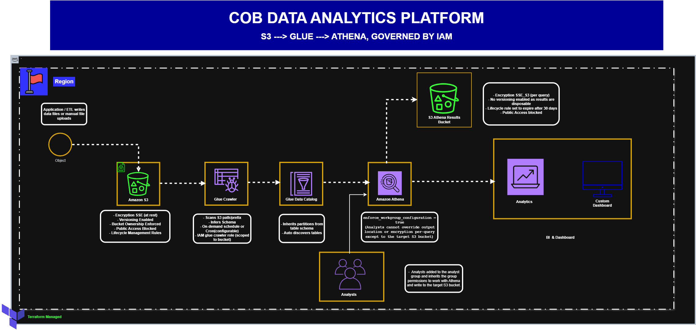

# COB — Beejan Technologies Internal Terraform Platform

COB is an internal, reusable Terraform module library built by the Platform
Engineering team at Beejan Technologies. It provides standardised,
secure-by-default AWS infrastructure building blocks so application, data,
and analytics teams can provision infrastructure consistently — without
re-designing the same VPC, IAM, storage, compute, or database patterns from
scratch on every project.

---

## Table of Contents

- [Why This Exists](#why-this-exists)
- [Folder Structure](#folder-structure)
- [Modules](#modules)
- [Architecture Diagram](#architecture-diagram)
- [Requirements](#requirements)
- [Getting Started](#getting-started)
- [Design Philosophy](#design-philosophy)
- [Challenges & Limitations](#challenges--limitations)
- [Future Improvements](#future-improvements)

---

## Why This Exists

Beejan Technologies has grown rapidly. The engineering organisation now
consists of several application, data, and analytics teams, all running
workloads on AWS. As the number of teams has increased, the Platform
Engineering team has become a bottleneck.

When a team needs infrastructure, they currently submit a request to
Platform Engineering. An engineer then manually provisions the required AWS
resources through the AWS Console or writes Terraform specifically for that
project. A typical request might require a VPC and subnets, security
groups, IAM roles and policies, S3 storage, EC2 instances, ECS
infrastructure, RDS databases, and other supporting resources.

This approach worked while the company was smaller, but it no longer
scales:

- Different teams use different configurations for similar resources —
  some S3 buckets have versioning enabled, others don't.
- IAM policies are inconsistent across projects.
- Naming and tagging conventions vary.
- Network configurations differ between projects.
- Infrastructure changes are difficult to track.

**COB solves this by providing a standardised, reusable set of Terraform
modules** that:

- Reduce the time required to provision infrastructure
- Standardise common AWS configurations
- Encourage secure-by-default infrastructure
- Reduce configuration inconsistencies
- Make infrastructure reusable across projects and environments
- Allow Platform Engineering to improve standards centrally, without
  rewriting every application team's infrastructure

---

## Folder Structure

```
COB/
│
├── modules/
│   ├── networking/              # VPC, subnets, routing, security groups
│   ├── s3/                      # Standardised, secure-by-default S3 buckets
│   ├── iam/                     # Least-privilege roles, groups, and users
│   ├── rds/                     # PostgreSQL RDS with networking + secrets integration
│   ├── compute/                 # EC2 (ASG) and ECS (Fargate)
│   └── data_platform/           # Glue Data Catalog + Athena for analytics
│
├── infra_example/               # Example root configuration consuming the COB modules
│   ├── main.tf
│   ├── variables.tf
│   ├── outputs.tf
│   ├── terraform.tfvars
│   ├── backend.tf
│   ├── providers_config.tf
│   └── .gitignore
│
|── images/ 
|   ├── cob_data_platform_architectural_diagram.gif
|   └── deployment_screenshot.png
|
└── README.md                 
```


`infra_example/` demonstrates how a team would actually *consume* the COB
modules to stand up a real environment. The modules themselves are
designed to be reusable across any number of such root configurations —
one per project, or one per environment (dev/staging/prod), each with its
own `terraform.tfvars` and backend state.

---

## Modules

Each module has its own README with full documentation — parameters,
outputs, design decisions, and limitations. This section is a summary
only.

| Module | Summary | Docs |
|---|---|---|
| **networking** | VPC with public, private, and database subnet tiers across multiple AZs; NAT gateways for HA; route tables; a reusable security group with dynamic ingress/egress rules | [modules/networking/README.md](modules/networking/README.md) |
| **s3** | Secure-by-default S3 bucket: versioning, public access fully blocked, ownership controls, lifecycle rules for cost-managed version retention | [modules/s3/README.md](modules/s3/README.md) |
| **iam** | Least-privilege IAM roles for EC2, ECS (execution + task), and Glue; an analysts group scoped to Athena/Glue/S3 read access; user provisioning | [modules/iam/README.md](modules/iam/README.md) |
| **rds** | PostgreSQL RDS instance deployed into isolated database subnets, encrypted, credentials generated and stored in Secrets Manager (never in state or tfvars) | [modules/rds/README.md](modules/rds/README.md) |
| **compute** | EC2 via Launch Template + Auto Scaling Group (public and private tiers, independently toggleable) and ECS Fargate cluster/service | [modules/compute/README.md](modules/compute/README.md) |
| **data_platform** | Glue Data Catalog + crawler to catalog S3 data, plus an Athena workgroup with enforced, encrypted query result storage | [modules/data_platform_services/README.md](modules/data_platform_services/README.md) |

---

## Architecture Diagram

The diagram below demonstrates a focused use case: exposing data stored in
S3 to analytics users via Glue and Athena, governed by IAM.



**Flow:**
1. Application data lands in the **S3** module's bucket.
2. The **Glue Crawler** (IAM module's `glue_crawler_role`) scans the
   bucket and populates the **Glue Data Catalog** with table metadata.
3. Analysts (IAM module's `analysts` group) query the catalog through
   **Athena**, using a workgroup that enforces encrypted, access-controlled
   query result storage.
4. All access is governed by least-privilege IAM policies — analysts can
   read the data bucket and write to the results bucket, and nothing more.

### Deployment Screenshots

- [S3 bucket configuration](images/s3-bucket.png)
- [Glue Data Catalog with discovered tables](images/glue-catalog.png)
- [Athena query execution](images/athena-query.png)
- [Athena query results](images/athena-results.png)
- [IAM roles and groups](images/iam-roles.png)

---

## Requirements

Before using any COB module, ensure the following are in place:

### AWS Account & Authentication

- An active AWS account with sufficient permissions to create VPCs, IAM
  resources, S3 buckets, RDS instances, ECS/EC2 resources, and Glue/Athena
  resources.
- AWS CLI installed and configured via **`aws configure`** or **`aws sso login`**.


**Note on credentials:**
- This project deliberately avoids the use of long-lived IAM access keys anywhere in its design. EC2 instances and ECS tasks authenticate via IAM roles (instance profiles / task roles) and never static credentials.

- Local `terraform apply` runs rely on your AWS CLI's configured credentials (SSO or configured profile) rather than keys embedded in any Terraform file. This reduces the risk of credential leakage through version control or state files.

### Terraform & Providers

- Terraform >= 1.15
- Provider versions used across these modules:

| Provider | Version | Purpose |
|---|---|---|
| `hashicorp/aws` | `="6.58.0"` | All AWS resource provisioning |
| `hashicorp/random` | `="3.9.0"` | Password/suffix generation for uniqueness |
| `hashicorp/local` | `="2.9.0"` | (used in early local-file learning exercises, not in the COB modules themselves) |

### Backend

- An S3 bucket (with use_lockfile and encrypt set to true) is
  used for remote state — configured in `infra_example/backend.tf`.

---

## Getting Started

```bash
cd infra_example
terraform init
terraform fmt
terraform validate
terraform plan
terraform apply
```

Review the `infra_example/terraform.tfvars` and adjust project name,
environment, CIDR ranges, and per-module toggles (`create_ec2`,
`create_ecs`, etc.) and every other required parameter for what you want to provision before applying.

To tear down:
Comment out the resources you want to destroy in the main.tf, .tfvars, variable.tf and output.tf file and run

```bash
terraform plan
terraform apply
```

**Note :**
Some resources (RDS, in particular) have `deletion_protection` enabled
by default and must have that flag disabled and re-applied before a
successful `destroy` can work. This is deliberate and intentional design to avoid the destroy of a database instance by mistake — see the RDS module's README.md file for more details.

---

## Design Philosophy

Every module in COB follows the same underlying principles:

- **Secure by default** — public access blocked unless explicitly
  required; encryption at rest everywhere; least-privilege IAM scoping
  rather than broad managed policies wherever a custom policy was
  practical.

- **No static credentials** — IAM roles and instance profiles are used
  throughout; database credentials are generated randomly and stored in
  Secrets Manager, never hardcoded or committed.

- **Toggleable, not monolithic** — every module supports being partially
  or fully disabled via boolean flags (`create_ec2`, `create_ecs`,
  `create_public_ec2`, etc.), so consuming teams only provision what they
  actually need.

- **Consistent naming and tagging** — every resource is named using a
  shared `${project_name}-${environment}` convention, making resources
  identifiable and consistent across teams and environments.

---

## Challenges & Limitations

- **Circular dependencies between IAM and consumer modules.** IAM roles
  need to reference resource ARNs (S3 buckets, Secrets Manager secrets)
  that don't exist until *after* those modules run — but those modules'
  own resources need IAM role ARNs to function. This was resolved by
  constructing certain ARNs by naming convention (with wildcards) inside
  the IAM module, rather than passing live module outputs, breaking the
  cycle at the cost of a naming-convention coupling between modules that
  isn't enforced by Terraform itself.

- **IAM console password handling.** `aws_iam_user_login_profile` stores
  a plaintext password in Terraform state unless a PGP key is supplied
  per user. This project does not currently implement PGP encryption for
  generated console passwords — a known limitation, not an oversight.

- **AWS Free Tier constraints.** RDS backup retention is capped lower on
  free-tier accounts than typical production defaults (7 days) — the
  module's default was lowered to remain deployable on a free-tier
  account for testing/demo purposes.

- **No load balancer included.** The compute module's ASGs and ECS
  service are not currently fronted by an Application Load Balancer,
  meaning horizontal scaling is provisioned but not yet paired with
  traffic distribution — self-healing works, but elastic scaling isn't
  yet usable by live traffic without an ALB layered on top.

- **RDS deletion protection friction.** `deletion_protection = true` by
  default means a full `terraform destroy` requires manually disabling
  this flag first — an intentional safety measure, but one that adds a
  manual step during environment teardown.

---

## Future Improvements

- Add an optional Application Load Balancer module/integration so the
  compute module's ASG and ECS service can actually serve routed,
  load-balanced traffic.

- Implement PGP-based encryption for IAM user console passwords.
- Resolve module ARN cross-referencing without relying on naming-pattern
  wildcards, potentially via a dedicated "bootstrap" module or Terraform
  workspace ordering.

- Add automated tagging enforcement (e.g. via a shared `tags` module or
  provider-level `default_tags`) to guarantee tag consistency without
  relying on each module remembering to apply them.

- Add CI validation (`terraform validate`, `tflint`, `checkov`) to catch
  configuration drift and security misconfigurations automatically before
  merge.

- Support cross-region and multi-account deployment patterns as the
  organisation scales further.

---

## Contributing

This is an internal Platform Engineering project. Proposed changes to any
module should be accompanied by an update to that module's README
reflecting the new behaviour, parameters, or trade-offs introduced.